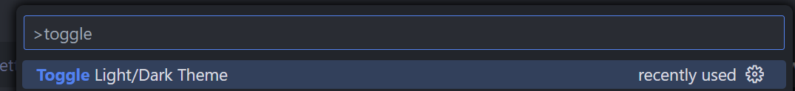
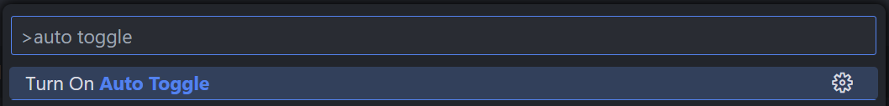
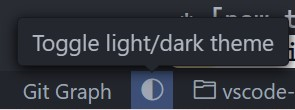

# Auto Light/Dark Theme Switch

A small tool to change your light/dark theme based on time or system preference.

## Settings

All the settings can be found in Settings > Extensions > Auto Light/Dark Theme Switch.

- `vscode-auto-light-dark-theme.autoToggle`: Whether to toggle theme automatically. Defaults to `true`.
- `vscode-auto-light-dark-theme.lightTheme`: Light theme to use. Defaults to `Light Modern`.
- `vscode-auto-light-dark-theme.darkTheme`: Dark theme to use. Defaults to `Dark Modern`.
- `vscode-auto-light-dark-theme.toggleSetting`: Toggle themes based on time or system preferences.
- `vscode-auto-light-dark-theme.lightStartTime`: The time to use light theme.
- `vscode-auto-light-dark-theme.darkStartTime`: The time to use dark theme.
- `vscode-auto-light-dark-theme.showToggleButton`: Whether to show toggle button on the status bar.

## Commands

- `vscode-auto-light-dark-theme.toggleTheme`: Toggle light/dark theme manually. The `autoToggle` will be turned off after using this command.

In case you want to try some new themes, or just want to turn on/off `autoToggle` without going to the Settings page, here are two commands to do it.

- `vscode-auto-light-dark-theme.turnOnAutoToggle`: Used to turn on `autoToggle`. Only shows up when `autoToggle` is `false`.
- `vscode-auto-light-dark-theme.turnOffAutoToggle`: Used to turn off `autoToggle`. Only shows up when `autoToggle` is `true`.

## Status bar button

A switch button is shown on the status bar by default. You can click it to toggle themes manually, and it behaves the same as the command `toggleTheme`. If you don't need it, you can hide it via the Settings page.

## Changelog

Changelog can be found [here](https://github.com/Clarkkkk/vscode-auto-light-dark-theme/blob/main/CHANGELOG.md).

## Acknowledgment

If you found it useful somehow, I would be grateful if you could leave a star in the project's [GitHub repository](https://github.com/Clarkkkk/vscode-auto-light-dark-theme.git). 

Bugs, feature requests and more are welcome here [GitHub Issues](https://github.com/Clarkkkk/vscode-auto-light-dark-theme/issues).

Thank you. 
